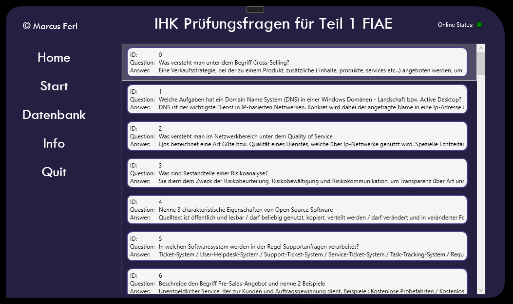

<h1> Prüfungs App zu Teil 1</h1>
 
Ich bin momentan dabei meine Lernkarten, welche ich mir beim U-Form verlag gekauft habe in ein 
kleines Programm zu übertragen. Die App ist mit C# erstellt, da es einfach am besten ist um Ausführbare programme 
für Windows zu erstellen. Und ich habe festgestellt, dass das .Net Framework einfach unfassbar groß ist
und man viel weniger auf externe Bibliotheken wie z.B in Python abhängig ist.

 
 
 

 
 

<h4>#Randnotizen</h4>

Runde Fenster Kanten

Menü Button Hover -> Rahmen und Schriftgröße ändert sich (Style erstelen)

Online Status -> Ping zur webseite -> Unterscheidung Server down oder eigenes Internet down

Copy Right als Laufschrift

Doppelklick auf Item in Datenbank -> öffnet neues Fenster mit der Antwort

Tooltips zu den Menü Buttons

Bei Verbindungsproblemen Client oder Serverseitig wird nun darauf hingewiesen

Json Url nun in die App Config Implementiert 

Info Frame erstellt